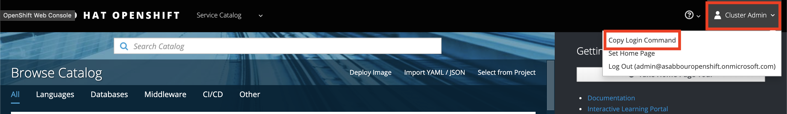

# Tutorial on Azure Red Hat OpenShift

Azure Red Hat OpenShift is Managed OpenShift solution that you can deploy OpenShift cluster quickly and run conntainers on it without the burden of maintaining underline infrastructures. 

## Deploy OpenShift cluster

Make sure latest az cli tool (v2.0.65 or above) is installed. 

```
$ az --version
azure-cli                         2.0.76
```

Login
```
$ az login
```
Register required az providers and freatures
```
az feature register --namespace Microsoft.ContainerService -n AROGA
az provider register -n Microsoft.Storage --wait
az provider register -n Microsoft.Compute --wait
az provider register -n Microsoft.Solutions --wait
az provider register -n Microsoft.Network --wait
az provider register -n Microsoft.KeyVault --wait
az provider register -n Microsoft.ContainerService --wait
```
Create an Azure Active Directory (Azure AD) tenant which will be intergrated with OpenShift/Kubernetes RBAC features.
https://docs.microsoft.com/en-us/azure/openshift/howto-create-tenant

Create Azure AD app object and user
https://docs.microsoft.com/en-us/azure/openshift/howto-aad-app-configuration

Set variables below
```
CLUSTER_NAME=myarocluster
LOCATION=southeastasia

# In this tutorial, credentials are managed as secrets using Azure Key Vault. Retreive secrets from the keyvault.
keyvault=$(az resource list --tag arocluster=myarocluster | jq -r .[0].name)
TENANT=$(az keyvault secret show -n myarocluster-tenant-id --vault-name ${keyvault} | jq -r .value) && echo " - tenant ID: ${TENANT}"
GROUPID=$(az keyvault secret show -n myarocluster-customer-admin-group-id --vault-name ${keyvault} | jq -r .value) && echo " - group ID: ${GROUPID}"
APPID=$(az keyvault secret show -n myarocluster-aad-client-app-id --vault-name ${keyvault} | jq -r .value) && echo " - group ID: ${APPID}"
SECRET=$(az keyvault secret show -n myarocluster-aad-client-app-secret --vault-name ${keyvault} | jq -r .value) && echo " - group ID: ${SECRET}"
```
Deploy an Azure Red Hat OpenShift cluster
```
# create resource group
az group create --name $CLUSTER_NAME --location $LOCATION

# create Azure Red Hat OpenShift cluster
az openshift create --resource-group $CLUSTER_NAME --name $CLUSTER_NAME -l $LOCATION --aad-client-app-id $APPID --aad-client-app-secret $SECRET --aad-tenant-id $TENANT --customer-admin-group-id $GROUPID
```

Get OpenShift Web console (OC) sign in URL for your cluster
```
az openshift show -n $CLUSTER_NAME -g $CLUSTER_NAME
```

Update your app registration redirect URI (https://docs.microsoft.com/en-us/azure/openshift/tutorial-create-cluster#step-3-update-your-app-registration-redirect-uri)

Sign in with user account created in the Azure AD tenant which is created earlier.


On client PC (bash), Install OC Client
```
cd ~
wget https://github.com/openshift/origin/releases/download/v3.11.0/openshift-origin-client-tools-v3.11.0-0cbc58b-linux-64bit.tar.gz
mkdir openshift
tar -zxvf openshift-origin-client-tools-v3.11.0-0cbc58b-linux-64bit.tar.gz -C openshift --strip-components=1
echo 'export PATH=$PATH:~/openshift' >> ~/.bashrc && source ~/.bashrc
```
Retrieve login command and token from OpenShift Web Console


Login using OC tool (Part of domain name, token, and username was hidden to hide my credential.)
```
$ oc login https://openshift.xxxxxxxxxxxxxxxxxxxx.southeastasia.azmosa.io --token={token-goes-here}
Logged into "https://openshift.xxxxxxxxxxxxxxxxxxxx.southeastasia.azmosa.io:443" as "username@domain" using the token provided.

You don't have any projects. You can try to create a new project, by running

    oc new-project <projectname>
```

## Using Persistent Storage in Azure Red Hat OpenShift cluster
When a pod needs persistent volume, create Persistent Volume Claim which will create Azure Managed Disk or Azure File Share.

A PersistentVolumeClaim requests either Disk or File storage of a particular StorageClass, access mode, and size. The Kubernetes API server dynamically provisions the underlying storage resource in Azure if there is no existing resource to fulfill the claim based on the defined StorageClass.

https://docs.openshift.com/aro/architecture/additional_concepts/storage.html
https://docs.openshift.com/aro/dev_guide/persistent_volumes.html
https://docs.microsoft.com/en-us/azure/aks/concepts-storage#persistent-volume-claims


## Reference materials
https://docs.openshift.com/aro/admin_guide/manage_rbac.html
https://github.com/microsoft/aroworkshop
https://aka.ms/openshift/ebook


